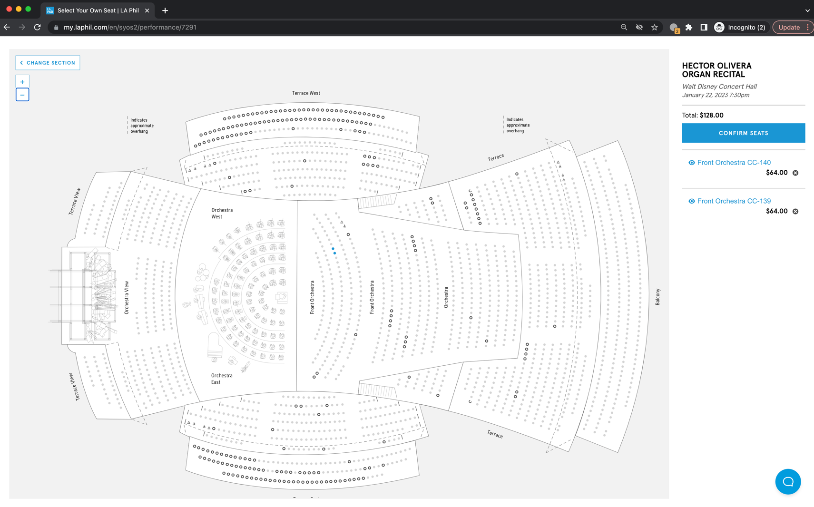

# Practical Task for BE Node.js Engineer

## General

The task is quite simple, you need to build a simple service which will fetch concert tickets from a website and return them to user through a HTTP call

## Principles
* Implement all with Typescript
* Don't use OOP principles and SOA architecture. Instead, try to make it as much functional (FP style) as possible
* Use Either data structure to make your errors explicit
* Try to keep CPU complexity as little as possible
* As we use fp-ts library for functional programming in our codebase - it would be a plus if you use it as well

## Task
* You should create a single HTTP e``ndpoint which accepts the ID of the event and returns list of tickets that are available for that event
* Ticket data should contain these fields:
    * Section
    * Row
    * Seat number
    * Price

## Website with tickets
* URL: https://my.laphil.com/en/syos2/performance/7291
* In order to see all tickets - click on "Any Best Available Seat" and then Continue

## Task output
* Link to repository with a codebase or ZIP file with a codebase

Wish you good luck,
Roman.