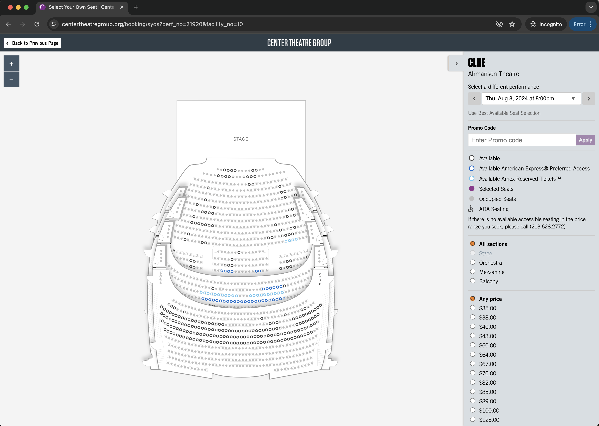

# Practical Task for BE Node.js Engineer

## General

The task is quite simple, you need to build a simple service which will fetch concert tickets from a website and return them to user through a HTTP call

## Principles
* Implement all with Typescript
* Try to keep CPU complexity as little as possible
* Try to follow layered architecture principles: separate business logic from third-party integrations, etc.

## Bonus points (not required):
* Use GraphQL as a way to query your service
* Add e2e test that demonstrate that everything works as expected

## Task
* You should create a single HTTP endpoint which accepts the ID of the event and returns list of tickets that are available for that event
* Ticket data should contain these fields:
    * Section
    * Row
    * Seat number
    * Price

## Definition of Done:
* Link to repository with code is provided to FRT team
* Service can be launched with a command `npm start`
* Tests can be launched on any environment and they will be green
* Tests are verifying that app works as expected
* App can be queries through GraphQL endpoint to fetch available tickets for specific event ID.

## Website with tickets
* URL: https://www.centertheatregroup.org/booking/syos?perf_no=21920&facility_no=10 (if it doesn't have tickets anymore - please use any other event on this platform)

## Task output
* Link to repository with a codebase

Wish you good luck,
Andrew.
